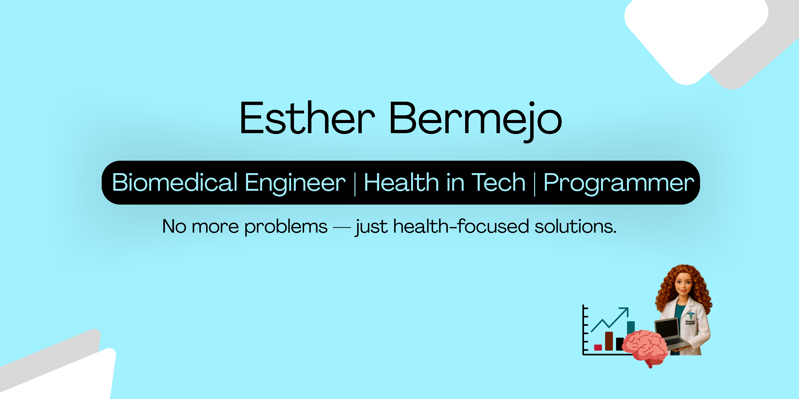

**estherbermejo/estherbermejo** is a ✨ _special_ ✨ repository. Here you can see the magic.

Here are some ideas to get you started:

# Portfolio Esther Bermejo's projects
Guide for all projects developed during the bachelor course of biomedical engineering

## 🎮 Body Track VR – EMG Biofeedback in Virtual Reality. Final degree project.

**Body Track VR** is an interactive VR application that visualizes EMG (electromyographic) activity on a customizable 3D avatar. Users can select specific muscles and receive real-time biofeedback via color-coded overlays based on EMG intensity.

🧠 Developed in **Unity**, using **C#**, **MATLAB**, and integrated with the **Ultium EMG system (Noraxon)**.  
🎓 Final Degree Project (TFG) – **Biomedical Engineering**, University of Alicante (Grade: 9.5/10).  

🔗 [📂 View Code](https://github.com/estherbermejo/tfg-rv_avatar_design_for_emg_biofeedback/tree/main/Scripts)  
🔗 [📄 See Report](https://github.com/estherbermejo/tfg-rv_avatar_design_for_emg_biofeedback/blob/main/memoria.pdf) 
🔗 [🎥 Defense Presentation](https://www.canva.com/design/DAGs942APQg/jBIzGY0BiNMfOCBnd0tItw/watch?utm_content=DAGs942APQg&utm_campaign=designshare&utm_medium=link2&utm_source=uniquelinks&utlId=h15eaddfdf9)
### 🧬 Fundamentals of Programming
- [Analysis and statistics of RNA and DNA sequences](https://github.com/estherbermejo/dna_stadistics.git)

## 💉 Clinical systems infraestructure
- [Glucometer](https://github.com/estherbermejo/glucometer)
- [Patient's register](https://github.com/estherbermejo/patients_register)
- [Ampliation to phone version with Cordova](https://github.com/estherbermejo/phone-version-of-glucometer-and-patient-s-data)

## 📊 Clinical data analysis
- [Study of the readmission of patients with diabetes](https://github.com/estherbermejo/readmission-of-patients-with-diabetes)

## 🩻 Medical image analysis and processing
- [Fracture analyzer and classifier](https://github.com/estherbermejo/fracture-analyzer-and-classifier)

## 🖥️ Distributed systems + Telemedicine and Telecare
- [Primary care and specialist healthcare platform](https://github.com/estherbermejo/primary-care-and-specialist-healthcare-platform)

## ⚡ Security and confidentiality
- [Implementation of security protocols for a medical records manager](https://github.com/estherbermejo/medical-records-manager)
